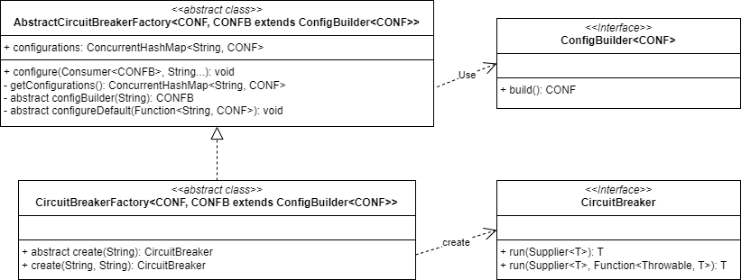

# Circuit Breaker

## 一、UML



## 二、重要类

### ConfigBuilder

```java
// 断路器配置构建器。
public interface ConfigBuilder<CONF> {
	CONF build();
}
```

### AbstractCircuitBreakerFactory

```java
// 生产断路器的工厂的基类。
public abstract class AbstractCircuitBreakerFactory<CONF, CONFB extends ConfigBuilder<CONF>> {

	private final ConcurrentHashMap<String, CONF> configurations = new ConcurrentHashMap<>();
    
	// 添加断路器配置。
	// @param ids 断路器 ID
	// @param consumer 配置构建器消费者，允许消费者在配置构建之前自定义构建器
	public void configure(Consumer<CONFB> consumer, String... ids) {
		for (String id : ids) {
			CONFB builder = configBuilder(id);
			consumer.accept(builder);
			CONF conf = builder.build();
			getConfigurations().put(id, conf);
		}
	}
    
	// 获取断路器的配置。
	// @return 配置
	protected ConcurrentHashMap<String, CONF> getConfigurations() {
		return configurations;
	}
    
	// 根据给定的 ID 创建配置构建器。
	// @param id 断路器的 ID
	// @return 配置构建器
	protected abstract CONFB configBuilder(String id);
    
	// 设置断路器的默认配置。
	// @param defaultConfiguration 返回默认配置的函数
	public abstract void configureDefault(Function<String, CONF> defaultConfiguration);

}
```

### CircuitBreakerFactory/ReactiveCircuitBreakerFactory

```java
// 1. CircuitBreakerFactory
// 根据底层实现创建断路器。
public abstract class CircuitBreakerFactory<CONF, CONFB extends ConfigBuilder<CONF>>
		extends AbstractCircuitBreakerFactory<CONF, CONFB> {

	public abstract CircuitBreaker create(String id);

	public CircuitBreaker create(String id, String groupName) {
		return create(id);
	}

}

// 2. ReactiveCircuitBreakerFactory
// 创建反应式断路器。
public abstract class ReactiveCircuitBreakerFactory<CONF, CONFB extends ConfigBuilder<CONF>>
        extends AbstractCircuitBreakerFactory<CONF, CONFB> {

    public abstract ReactiveCircuitBreaker create(String id);

    public ReactiveCircuitBreaker create(String id, String groupName) {
        return create(id);
    }

}
```

### CircuitBreaker/ReactiveCircuitBreaker

```java
// 1. CircuitBreaker
// Spring Cloud 断路器。
public interface CircuitBreaker {

    default <T> T run(Supplier<T> toRun) {
        return run(toRun, throwable -> {
            throw new NoFallbackAvailableException("No fallback available.", throwable);
        });
    }

    <T> T run(Supplier<T> toRun, Function<Throwable, T> fallback);

}

// 2. ReactiveCircuitBreaker
// Spring Cloud 反应式断路器 API。
public interface ReactiveCircuitBreaker {

    default <T> Mono<T> run(Mono<T> toRun) {
        return run(toRun, throwable -> {
            throw new NoFallbackAvailableException("No fallback available.", throwable);
        });
    }

    <T> Mono<T> run(Mono<T> toRun, Function<Throwable, Mono<T>> fallback);

    default <T> Flux<T> run(Flux<T> toRun) {
        return run(toRun, throwable -> {
            throw new NoFallbackAvailableException("No fallback available.", throwable);
        });
    }

    <T> Flux<T> run(Flux<T> toRun, Function<Throwable, Flux<T>> fallback);

}
```

## 三、其他类

### Customizer

```java
// 自定义参数化类。
public interface Customizer<TOCUSTOMIZE> {

	void customize(TOCUSTOMIZE tocustomize);

	// 创建一个包装好的定制器，保证被委托的 <code>customizer</code> 的 {@link #customize(Object)} 方法在每个目标上最多被调用一次。
	// @param customizer 被委托的定制器
	// @param keyMapper 生成目标标识符的映射函数
	// @param <T> 待定制目标的类型
	// @param <K> 目标标识符的类型
	// @return 包装好的定制器
	static <T, K> Customizer<T> once(Customizer<T> customizer, Function<? super T, ? extends K> keyMapper) {
		final ConcurrentMap<K, Boolean> customized = new ConcurrentHashMap<>();
		return t -> {
			final K key = keyMapper.apply(t);
			customized.computeIfAbsent(key, k -> {
				customizer.customize(t);
				return true;
			});
		};
	}

}
```

## 四、使用示例

```java
// 1. 熔断器配置信息（Config）
public class XxxConfig {
    // ...
}

// 2. 熔断器配置构建器（ConfigBuilder）
public class XxxConfigBuilder implements ConfigBuilder<XxxConfig> {
    @Override
    public XxxConfig build() {
        return new XxxConfig();
    }
}

// 3. 熔断器（CircuitBreaker）
public class XxxCircuitBreaker implements CircuitBreaker {
    public <T> T run(Supplier<T> toRun, Function<Throwable, T> fallback) {
        try {
            return toRun.get();
        } catch (Throwable throwable) {
            return apply(throwable);
        }
    }
}

// 4. 熔断器构建工厂（CircuitBreakerFactory）
public class XxxCircuitBreakerFactory 
        extends CircuitBreakerFactory<XxxConfig, XxxConfigBuilder> {

    private final XxxConfig config;
    private final XxxConfigBuilder configBuilder;
    public XxxCircuitBreaker(XxxConfigBuilder configBuilder){
        this.configBuilder = configBuilder;
        this.config = configBuilder.build();
    }
    
    // 使用 Config 来构建 CircuitBreaker
    @Override
    public CircuitBreaker create(String id) {
        return new XxxCircuitBreaker(this.config);
    }
}

// 5. 测试
class Test {
    public static void main(String[] args) {
        XxxCircuitBreakerFactory circuitBreakerFactory = new XxxCircuitBreakerFactory();
        // todo: 这里可以通过自定义 Customizer<XxxCircuitBreakerFactory>，对 XxxCircuitBreakerFactory 进行自定义处理
        CircuitBreaker circuitBreaker = circuitBreakerFactory.create(null);
        // todo: 这里可以通过自定义 Customizer<XxxCircuitBreaker>，对 XxxCircuitBreaker 进行自定义处理
        circuitBreaker.run(() -> "normal invoke", throwable -> "fallback invoke");
    }
}
```

## 五、实际应用

### 在 spring-cloud-circuitbreaker-sentinel 源码中的应用

```java
// 来自：com.alibaba.cloud:spring-cloud-circuitbreaker-sentinel:2023.0.0.0-RC1
// 1. SentinelConfigBuilder
public class SentinelConfigBuilder implements
		ConfigBuilder<SentinelConfigBuilder.SentinelCircuitBreakerConfiguration> {

	private String resourceName;
	private EntryType entryType;
	private List<DegradeRule> rules;

	// ...
	@Override
	public SentinelCircuitBreakerConfiguration build() {
		Assert.hasText(resourceName, "resourceName cannot be empty");
		List<DegradeRule> rules = Optional.ofNullable(this.rules)
				.orElse(new ArrayList<>());

		EntryType entryType = Optional.ofNullable(this.entryType).orElse(EntryType.OUT);
		return new SentinelCircuitBreakerConfiguration()
				.setResourceName(this.resourceName).setEntryType(entryType)
				.setRules(rules);
	}

	public static class SentinelCircuitBreakerConfiguration {
		private String resourceName;
		private EntryType entryType;
		private List<DegradeRule> rules;
        // ...
	}
}

// 2. SentinelCircuitBreaker
public class SentinelCircuitBreaker implements CircuitBreaker {

    private final String resourceName;

    private final EntryType entryType;

    private final List<DegradeRule> rules;

    public SentinelCircuitBreaker(String resourceName, EntryType entryType,
                                  List<DegradeRule> rules) {
        Assert.hasText(resourceName, "resourceName cannot be blank");
        Assert.notNull(rules, "rules should not be null");
        this.resourceName = resourceName;
        this.entryType = entryType;
        this.rules = Collections.unmodifiableList(rules);

        applyToSentinelRuleManager();
    }

    public SentinelCircuitBreaker(String resourceName, List<DegradeRule> rules) {
        this(resourceName, EntryType.OUT, rules);
    }

    public SentinelCircuitBreaker(String resourceName) {
        this(resourceName, EntryType.OUT, Collections.emptyList());
    }

    private void applyToSentinelRuleManager() {
        if (this.rules == null || this.rules.isEmpty()) {
            return;
        }
        Set<DegradeRule> ruleSet = new HashSet<>(DegradeRuleManager.getRules());
        for (DegradeRule rule : this.rules) {
            if (rule == null) {
                continue;
            }
            rule.setResource(resourceName);
            ruleSet.add(rule);
        }
        DegradeRuleManager.loadRules(new ArrayList<>(ruleSet));
    }

    @Override
    public <T> T run(Supplier<T> toRun, Function<Throwable, T> fallback) {
        Entry entry = null;
        try {
            entry = SphU.entry(resourceName, entryType);
            // 如果 SphU.entry() 没有抛出 `BlockException`，则表示请求可以通过。
            return toRun.get();
        }
        catch (BlockException ex) {
            // SphU.entry() 可能会抛出 BlockException，这表示请求被拒绝（触发了流量控制或断路器机制）。因此，它不应被视为业务异常。
            return fallback.apply(ex);
        }
        catch (Exception ex) {
            // 对于其他类型的异常，我们将通过 Tracer.trace(ex) 来追踪异常计数。
            Tracer.trace(ex);
            return fallback.apply(ex);
        }
        finally {
            // 确保调用已完成。
            if (entry != null) {
                entry.exit();
            }
        }
    }

}


// 3. SentinelCircuitBreakerFactory
public class SentinelCircuitBreakerFactory extends
        CircuitBreakerFactory<SentinelCircuitBreakerConfiguration, SentinelConfigBuilder> {

    private Function<String, SentinelConfigBuilder.SentinelCircuitBreakerConfiguration> defaultConfiguration = id -> new SentinelConfigBuilder()
            .resourceName(id).entryType(EntryType.OUT).rules(new ArrayList<>()).build();

    @Override
    public CircuitBreaker create(String id) {
        Assert.hasText(id, "A CircuitBreaker must have an id.");
        SentinelConfigBuilder.SentinelCircuitBreakerConfiguration conf = getConfigurations()
                .computeIfAbsent(id, defaultConfiguration);
        return new SentinelCircuitBreaker(id, conf.getEntryType(), conf.getRules());
    }

    @Override
    protected SentinelConfigBuilder configBuilder(String id) {
        return new SentinelConfigBuilder(id);
    }

    @Override
    public void configureDefault(
            Function<String, SentinelCircuitBreakerConfiguration> defaultConfiguration) {
        this.defaultConfiguration = defaultConfiguration;
    }

}

// 4. SentinelCircuitBreakerAutoConfiguration
@Configuration(proxyBeanMethods = false)
@ConditionalOnClass({ SphU.class })
@ConditionalOnProperty(name = "spring.cloud.circuitbreaker.sentinel.enabled",
        havingValue = "true", matchIfMissing = true)
public class SentinelCircuitBreakerAutoConfiguration {

    @Autowired(required = false)
    private List<Customizer<SentinelCircuitBreakerFactory>> customizers = new ArrayList<>();

    @Bean
    @ConditionalOnMissingBean(CircuitBreakerFactory.class)
    public CircuitBreakerFactory sentinelCircuitBreakerFactory() {
        SentinelCircuitBreakerFactory factory = new SentinelCircuitBreakerFactory();
        customizers.forEach(customizer -> customizer.customize(factory));
        return factory;
    }

}
```