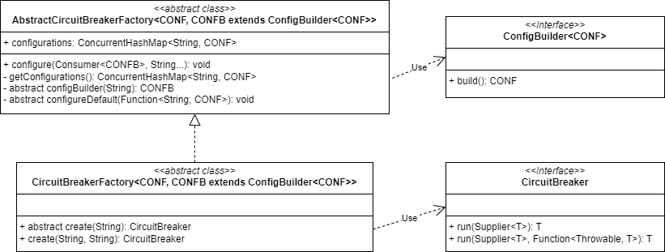

# Circuit Breaker

## 一、UML



## 二、重要类

### ConfigBuilder

```java
// 断路器配置构建器。
public interface ConfigBuilder<CONF> {

	CONF build();

}
```

### AbstractCircuitBreakerFactory

```java
// 生产断路器的工厂的基类。
public abstract class AbstractCircuitBreakerFactory<CONF, CONFB extends ConfigBuilder<CONF>> {

	private final ConcurrentHashMap<String, CONF> configurations = new ConcurrentHashMap<>();
    
	// 添加断路器配置。
	// @param ids 断路器 ID
	// @param consumer 配置构建器消费者，允许消费者在配置构建之前自定义构建器
	public void configure(Consumer<CONFB> consumer, String... ids) {
		for (String id : ids) {
			CONFB builder = configBuilder(id);
			consumer.accept(builder);
			CONF conf = builder.build();
			getConfigurations().put(id, conf);
		}
	}
    
	// 获取断路器的配置。
	// @return 配置
	protected ConcurrentHashMap<String, CONF> getConfigurations() {
		return configurations;
	}
    
	// 根据给定的 ID 创建配置构建器。
	// @param id 断路器的 ID
	// @return 配置构建器
	protected abstract CONFB configBuilder(String id);
    
	// 设置断路器的默认配置。
	// @param defaultConfiguration 返回默认配置的函数
	public abstract void configureDefault(Function<String, CONF> defaultConfiguration);

}
```

### CircuitBreakerFactory/ReactiveCircuitBreakerFactory

```java
// 1. CircuitBreakerFactory
// 根据底层实现创建断路器。
public abstract class CircuitBreakerFactory<CONF, CONFB extends ConfigBuilder<CONF>>
		extends AbstractCircuitBreakerFactory<CONF, CONFB> {

	public abstract CircuitBreaker create(String id);

	public CircuitBreaker create(String id, String groupName) {
		return create(id);
	}

}

// 2. ReactiveCircuitBreakerFactory
// 创建反应式断路器。
public abstract class ReactiveCircuitBreakerFactory<CONF, CONFB extends ConfigBuilder<CONF>>
        extends AbstractCircuitBreakerFactory<CONF, CONFB> {

    public abstract ReactiveCircuitBreaker create(String id);

    public ReactiveCircuitBreaker create(String id, String groupName) {
        return create(id);
    }

}
```

### CircuitBreaker/ReactiveCircuitBreaker

```java
// 1. CircuitBreaker
// Spring Cloud 断路器。
public interface CircuitBreaker {

    default <T> T run(Supplier<T> toRun) {
        return run(toRun, throwable -> {
            throw new NoFallbackAvailableException("No fallback available.", throwable);
        });
    }

    <T> T run(Supplier<T> toRun, Function<Throwable, T> fallback);

}

// 2. ReactiveCircuitBreaker
// Spring Cloud 反应式断路器 API。
public interface ReactiveCircuitBreaker {

    default <T> Mono<T> run(Mono<T> toRun) {
        return run(toRun, throwable -> {
            throw new NoFallbackAvailableException("No fallback available.", throwable);
        });
    }

    <T> Mono<T> run(Mono<T> toRun, Function<Throwable, Mono<T>> fallback);

    default <T> Flux<T> run(Flux<T> toRun) {
        return run(toRun, throwable -> {
            throw new NoFallbackAvailableException("No fallback available.", throwable);
        });
    }

    <T> Flux<T> run(Flux<T> toRun, Function<Throwable, Flux<T>> fallback);

}
```

## 三、其他类

### Customizer

```java
// 自定义参数化类。
public interface Customizer<TOCUSTOMIZE> {

	void customize(TOCUSTOMIZE tocustomize);

	// 创建一个包装好的定制器，保证被委托的 <code>customizer</code> 的 {@link #customize(Object)} 方法在每个目标上最多被调用一次。
	// @param customizer 被委托的定制器
	// @param keyMapper 生成目标标识符的映射函数
	// @param <T> 待定制目标的类型
	// @param <K> 目标标识符的类型
	// @return 包装好的定制器
	static <T, K> Customizer<T> once(Customizer<T> customizer, Function<? super T, ? extends K> keyMapper) {
		final ConcurrentMap<K, Boolean> customized = new ConcurrentHashMap<>();
		return t -> {
			final K key = keyMapper.apply(t);
			customized.computeIfAbsent(key, k -> {
				customizer.customize(t);
				return true;
			});
		};
	}

}
```

## 四、使用示例

```java
public class XxxConfig {
    // ...
}

public class XxxConfigBuilder implements ConfigBuilder<XxxConfig> {
    @Override
    public XxxConfig build() {
        return new XxxConfig();
    }
}

public class XxxCircuitBreaker implements CircuitBreaker {
    public <T> T run(Supplier<T> toRun, Function<Throwable, T> fallback) {
        try {
            return toRun.get();
        } catch (Throwable throwable) {
            return apply(throwable);
        }
    }
}

public class XxxCircuitBreakerFactory 
        extends CircuitBreakerFactory<XxxConfig, XxxConfigBuilder> {

    private final XxxConfig config;
    private final XxxConfigBuilder configBuilder;
    public XxxCircuitBreaker(XxxConfigBuilder configBuilder){
        this.configBuilder = configBuilder;
        this.config = configBuilder.build();
    }
    
    @Override
    public CircuitBreaker create(String id) {
        return new XxxCircuitBreaker(this.config);
    }
}

// 测试
class Test {
    public static void main(String[] args) {
        XxxCircuitBreakerFactory circuitBreakerFactory = new XxxCircuitBreakerFactory();
        CircuitBreaker circuitBreaker = circuitBreakerFactory.create(null);
        circuitBreaker.run(() -> "normal invoke", throwable -> "fallback invoke");
    }
}
```