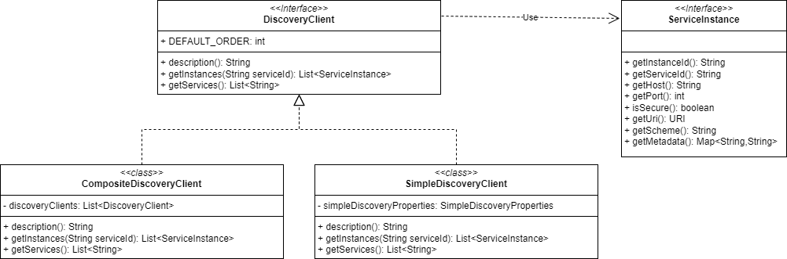
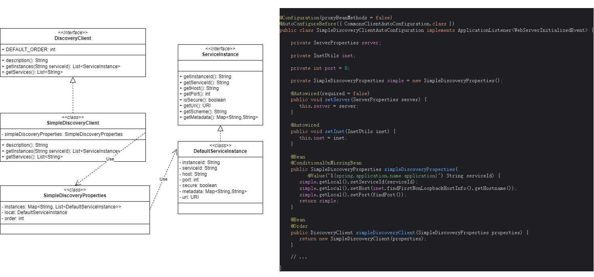

# Discovery

## 一、UML

### DiscoveryClient



#### SimpleDiscoveryClient



## 二、重要类

| 功能       | 依赖条件                                                                  | 是否依赖 @EnableDiscoveryClient           |
|----------|-----------------------------------------------------------------------|---------------------------------------|
| **服务发现** | `@ConditionalOnDiscoveryEnabled`                                      | ❌ 不需要，autoconfig 自动加载                 |
| **服务注册** | `@ConditionalOnDiscoveryEnabled` + `ServiceRegistryAutoConfiguration` | ✅ **需要**，通过 @EnableDiscoveryClient 触发 |

> **注意**：Spring Cloud Commons 4.1.x 中，`@EnableDiscoveryClient` 只会将进行本服务的自动注册。
> 而服务发现的功能时通过 XxxDiscoveryClientAutoConfiguration（它会检测 DiscoveryClient 是否存在） 来实现的；


### @EnableDiscoveryClient（启用服务自动注册）

```text
org/springframework/cloud/client/
        |
        ├── discovery/
        |       ├── EnableDiscoveryClient.java
        |       └── EnableDiscoveryClientImportSelector.java
        |
        └── serviceregistry/
                ├── AutoServiceRegistrationConfiguration.java
                └── AutoServiceRegistrationProperties.java
```

#### 1. @EnableDiscoveryClient

```java
// 用于启用 DiscoveryClient 实现的注解
@Target(ElementType.TYPE)
@Retention(RetentionPolicy.RUNTIME)
@Documented
@Inherited
@Import(EnableDiscoveryClientImportSelector.class)
public @interface EnableDiscoveryClient {
    
	// 如果为 true，ServiceRegistry 将自动注册本地服务器。
	// @return - 如果要自动注册，则返回 {@code true}。
	boolean autoRegister() default true; // 是否自动注册到服务注册中心，默认true

}
```

#### 2. EnableDiscoveryClientImportSelector

```java
public class EnableDiscoveryClientImportSelector extends SpringFactoryImportSelector<EnableDiscoveryClient> {

    @Override
    public String[] selectImports(AnnotationMetadata metadata) {
        String[] imports = super.selectImports(metadata);

        AnnotationAttributes attributes = AnnotationAttributes
                .fromMap(metadata.getAnnotationAttributes(getAnnotationClass().getName(), true));

        boolean autoRegister = attributes.getBoolean("autoRegister");

        if (autoRegister) {
            List<String> importsList = new ArrayList<>(Arrays.asList(imports));
            // important
            importsList.add("org.springframework.cloud.client.serviceregistry.AutoServiceRegistrationConfiguration");
            imports = importsList.toArray(new String[0]);
        } else {
            Environment env = getEnvironment();
            if (env instanceof ConfigurableEnvironment configEnv) {
                LinkedHashMap<String, Object> map = new LinkedHashMap<>();
                map.put("spring.cloud.service-registry.auto-registration.enabled", false);
                MapPropertySource propertySource = new MapPropertySource("springCloudDiscoveryClient", map);
                configEnv.getPropertySources().addLast(propertySource);
            }

        }

        return imports;
    }
    // ...
}
```

#### 3. AutoServiceRegistrationConfiguration

```java
@Configuration(proxyBeanMethods = false)
@EnableConfigurationProperties(AutoServiceRegistrationProperties.class) // -->
@ConditionalOnProperty(value = "spring.cloud.service-registry.auto-registration.enabled", matchIfMissing = true)
public class AutoServiceRegistrationConfiguration {

}

// --> @EnableConfigurationProperties(AutoServiceRegistrationProperties.class)
@ConfigurationProperties("spring.cloud.service-registry.auto-registration")
public class AutoServiceRegistrationProperties {

    /** Whether service auto-registration is enabled. Defaults to true. */
    // 是否启用服务自动注册。默认为 true。
    private boolean enabled = true;

    /** Whether to register the management as a service. Defaults to true. */
    // 是否将管理注册为服务。默认为 true。
    private boolean registerManagement = true;

    /**
     * Whether startup fails if there is no AutoServiceRegistration. Defaults to false.
     */
    // 如果没有 AutoServiceRegistration，启动是否失败。默认为 false。
    private boolean failFast = false;
 
    // ...
}
```

### DiscoveryClient / ReactiveDiscoveryClient（服务发现）

```text
org/springframework/cloud/client/
        |
        └── discovery/
                |
                ├── composite/
                |       ├── reactive/                   -- 组合实现 DiscoveryClient
                |       |       ├── ReactiveCompositeDiscoveryClientAutoConfiguration.java
                |       |       └── ReactiveCompositeDiscoveryClient.java
                |       ├── CompositeDiscoveryClient.java
                |       └── CompositeDiscoveryClientAutoConfiguration.java
                |
                ├── simple/                             -- 简单实现 DiscoveryClient
                |       ├── reactive/
                |       |       ├── SimpleReactiveDiscoveryClient.java
                |       |       ├── SimpleReactiveDiscoveryClientAutoConfiguration.java
                |       |       └── SimpleReactiveDiscoveryProperties.java
                |       ├── SimpleDiscoveryClient.java
                |       ├── SimpleDiscoveryClientAutoConfiguration.java
                |       └── SimpleDiscoveryProperties.java
                ├── ReactiveDiscoveryClient.java
                └── DiscoveryClient.java
```

```properties
# 来自 spring-cloud-commons/src/main/resources/META-INF/spring/org.springframework.boot.autoconfigure.AutoConfiguration.imports
org.springframework.cloud.client.CommonsClientAutoConfiguration
org.springframework.cloud.client.ReactiveCommonsClientAutoConfiguration
org.springframework.cloud.client.discovery.composite.CompositeDiscoveryClientAutoConfiguration
org.springframework.cloud.client.discovery.composite.reactive.ReactiveCompositeDiscoveryClientAutoConfiguration
org.springframework.cloud.client.discovery.simple.SimpleDiscoveryClientAutoConfiguration
org.springframework.cloud.client.discovery.simple.reactive.SimpleReactiveDiscoveryClientAutoConfiguration
```

#### 接口 DiscoveryClient

```java
// 表示通常可用于发现服务（例如 Netflix Eureka 或 consul.io）的读取操作。
public interface DiscoveryClient extends Ordered {
    
	// 发现客户端的默认顺序。
	int DEFAULT_ORDER = 0;
    
	// HealthIndicator 中使用的实现的人类可读的描述。
	// @return 描述。
	String description();
    
	// 获取与特定 serviceId 关联的所有 ServiceInstances。
	// @param serviceId 要查询的服务 ID。
	// @return 服务实例列表。
	List<ServiceInstance> getInstances(String serviceId);
    
	// @return 所有已知的服务 ID。
	List<String> getServices();
    
	// 可用于验证客户端是否有效以及是否能够进行调用。
	// <p>调用成功且未抛出任何异常，则表示客户端能够进行调用。
	// <p>默认实现仅调用 {@link #getServices()} - 客户端实现可以选择使用更轻量的操作进行覆盖。
	// probe --> 探测
	default void probe() {
		getServices();
	}
    
	// 获取发现客户端顺序的默认实现。
	@Override
	default int getOrder() {
		return DEFAULT_ORDER;
	}

}
```

##### 子类 SimpleDiscoveryClient（从属性文件中获取服务实例）

```java
// {@link org.springframework.cloud.client.discovery.DiscoveryClient} 将使用属性文件作为服务实例的源。
public class SimpleDiscoveryClient implements DiscoveryClient {

    private SimpleDiscoveryProperties simpleDiscoveryProperties;

    public SimpleDiscoveryClient(SimpleDiscoveryProperties simpleDiscoveryProperties) {
        this.simpleDiscoveryProperties = simpleDiscoveryProperties;
    }

    @Override
    public String description() {
        return "Simple Discovery Client";
    }

    @Override
    public List<ServiceInstance> getInstances(String serviceId) {
        List<ServiceInstance> serviceInstances = new ArrayList<>();
        List<DefaultServiceInstance> serviceInstanceForService = this.simpleDiscoveryProperties.getInstances()
                .get(serviceId);
        if (serviceInstanceForService != null) {
            serviceInstances.addAll(serviceInstanceForService);
        }
        return serviceInstances;
    }

    @Override
    public List<String> getServices() {
        return new ArrayList<>(this.simpleDiscoveryProperties.getInstances().keySet());
    }

    @Override
    public int getOrder() {
        return this.simpleDiscoveryProperties.getOrder();
    }
}

@ConfigurationProperties(prefix = "spring.cloud.discovery.client.simple")
public class SimpleDiscoveryProperties implements InitializingBean {

    private Map<String, List<DefaultServiceInstance>> instances = new HashMap<>();
    
    // 本地实例的属性（如果存在）。如果用户要导出需要服务实例识别的数据（例如指标），则应明确设置这些属性。
    @NestedConfigurationProperty
    private DefaultServiceInstance local = new DefaultServiceInstance(null, null, null, 0, false);
    
    // ...
}
```

###### SimpleDiscoveryClientAutoConfiguration

```java
@Configuration(proxyBeanMethods = false)
@AutoConfigureBefore({ CommonsClientAutoConfiguration.class })
public class SimpleDiscoveryClientAutoConfiguration implements ApplicationListener<WebServerInitializedEvent> {

    private ServerProperties server;

    private InetUtils inet;

    private int port = 0;

    private SimpleDiscoveryProperties simple = new SimpleDiscoveryProperties();

    @Autowired(required = false)
    public void setServer(ServerProperties server) {
        this.server = server;
    }

    @Autowired
    public void setInet(InetUtils inet) {
        this.inet = inet;
    }

    @Bean
    @ConditionalOnMissingBean
    public SimpleDiscoveryProperties simpleDiscoveryProperties(
            @Value("${spring.application.name:application}") String serviceId) {
        simple.getLocal().setServiceId(serviceId);
        simple.getLocal().setHost(inet.findFirstNonLoopbackHostInfo().getHostname());
        simple.getLocal().setPort(findPort());
        return simple;
    }

    @Bean
    @Order
    public DiscoveryClient simpleDiscoveryClient(SimpleDiscoveryProperties properties) {
        return new SimpleDiscoveryClient(properties);
    }
    
    // ...
}


// ServerProperties
@ConfigurationProperties(prefix = "server", ignoreUnknownFields = true)
public class ServerProperties {
    // ...
}


// SimpleDiscoveryProperties
@ConfigurationProperties(prefix = "spring.cloud.discovery.client.simple")
public class SimpleDiscoveryProperties implements InitializingBean {

    // 实例映射
    private Map<String, List<DefaultServiceInstance>> instances = new HashMap<>();

    // 本地实例的属性（如果存在）。如果用户要导出需要服务实例识别的数据（例如指标），则应明确设置这些属性。
    @NestedConfigurationProperty
    private DefaultServiceInstance local = new DefaultServiceInstance(null, null, null, 0, false);

    private int order = DiscoveryClient.DEFAULT_ORDER;

    // ...

    @Override
    public void afterPropertiesSet() {
        for (String key : this.instances.keySet()) {
            for (DefaultServiceInstance instance : this.instances.get(key)) {
                instance.setServiceId(key);
            }
        }
    }

    // ...
}
```


##### 子类 CompositeDiscoveryClient（组合技 - 包含多个 DiscoveryClient）

```java
// {@link DiscoveryClient} 由其他发现客户端组成，并按顺序将调用委托给每个发现客户端。
public class CompositeDiscoveryClient implements DiscoveryClient {

// 复合发现客户端

	private final List<DiscoveryClient> discoveryClients;

	public CompositeDiscoveryClient(List<DiscoveryClient> discoveryClients) {
		AnnotationAwareOrderComparator.sort(discoveryClients);
		this.discoveryClients = discoveryClients;
	}

	@Override
	public String description() {
		return "Composite Discovery Client";
	}

	@Override
	public List<ServiceInstance> getInstances(String serviceId) {
		if (this.discoveryClients != null) {
			for (DiscoveryClient discoveryClient : this.discoveryClients) {
				List<ServiceInstance> instances = discoveryClient.getInstances(serviceId);
				if (instances != null && !instances.isEmpty()) {
					return instances;
				}
			}
		}
		return Collections.emptyList();
	}

	@Override
	public List<String> getServices() {
		LinkedHashSet<String> services = new LinkedHashSet<>();
		if (this.discoveryClients != null) {
			for (DiscoveryClient discoveryClient : this.discoveryClients) {
				List<String> serviceForClient = discoveryClient.getServices();
				if (serviceForClient != null) {
					services.addAll(serviceForClient);
				}
			}
		}
		return new ArrayList<>(services);
	}

	@Override
	public void probe() {
		if (this.discoveryClients != null) {
			for (DiscoveryClient discoveryClient : this.discoveryClients) {
				discoveryClient.probe();
			}
		}
	}

	public List<DiscoveryClient> getDiscoveryClients() {
		return this.discoveryClients;
	}

}
```

###### CompositeDiscoveryClientAutoConfiguration

```java
// 复合发现客户端的自动配置。
@Configuration(proxyBeanMethods = false)
@AutoConfigureBefore(SimpleDiscoveryClientAutoConfiguration.class)
public class CompositeDiscoveryClientAutoConfiguration {

	@Bean
	@Primary
	public CompositeDiscoveryClient compositeDiscoveryClient(List<DiscoveryClient> discoveryClients) {
		return new CompositeDiscoveryClient(discoveryClients);
	}

}
```


#### 接口 ReactiveDiscoveryClient

##### 子类 SimpleReactiveDiscoveryClient
###### SimpleReactiveDiscoveryClientAutoConfiguration

##### 子类 ReactiveCompositeDiscoveryClient
###### ReactiveCompositeDiscoveryClientAutoConfiguration


## 三、使用示例

```java
import java.util.List;

// 1. XxxDiscoveryProperties
public class XxxDiscoveryProperties implements InitializingBean {
    private String host;
    private int port;
    // ...
}

// 2. XxxDiscoveryClient
public class XxxDiscoveryClient implements DiscoveryClient {

    private XxxDiscoveryProperties properties;
    private NacosService service;       // nacos / zookeeper 等等

    public XxxDiscoveryClient(XxxDiscoveryProperties xxxDiscoveryProperties) {
        this.properties = xxxDiscoveryProperties;
    }

    public String description() {
        return "Xxx DiscoveryClient";
    }

    public List<ServiceInstance> getInstances(String serviceId) {
        // 根据配置信息（XxxDiscoveryProperties）和 serviceId 获取可用的服务实例
        List<DefaultServiceInstance> serviceInstanceForService =
                service.getInstances(this.properties, serviceId);
        if (serviceInstanceForService != null) {
            return serviceInstanceForService;
        } else {
            return List.of();
        }
    }

    public List<String> getServices() {
        // 根据配置信息（XxxDiscoveryProperties）获取所有的服务
        return service.getServices(this.properties);
    }

}

// 3. 示例
XxxDiscoveryProperties properties = new XxxDiscoveryProperties();
DiscoveryClient discoveryClient = new XxxDiscoveryClient(properties);

String serviceId = "order-service";
List<ServiceInstance> instanceList = discoveryClient.getInstances(serviceId);
```

## 四、实际应用

### 在 spring-cloud-starter-alibaba-nacos-discovery 中的应用

#### NacosDiscoveryClient

```java
// com.alibaba.cloud.nacos.discovery.NacosDiscoveryClient
public class NacosDiscoveryClient implements DiscoveryClient {
    // ...
	private NacosServiceDiscovery serviceDiscovery;
    // ...

	@Override
	public List<ServiceInstance> getInstances(String serviceId) {
		try {
			return Optional.of(serviceDiscovery.getInstances(serviceId))
					.map(instances -> {
						ServiceCache.setInstances(serviceId, instances);
						return instances;
					}).get();
		}
		catch (Exception e) {
			if (failureToleranceEnabled) {
				return ServiceCache.getInstances(serviceId);
			}
			throw new RuntimeException(
					"Can not get hosts from nacos server. serviceId: " + serviceId, e);
		}
	}

	@Override
	public List<String> getServices() {
		try {
			return Optional.of(serviceDiscovery.getServices()).map(services -> {
				ServiceCache.setServiceIds(services);
				return services;
			}).get();
		}
		catch (Exception e) {
			log.error("get service name from nacos server failed.", e);
			return failureToleranceEnabled ? ServiceCache.getServiceIds()
					: Collections.emptyList();
		}
	}

}

// com.alibaba.cloud.nacos.discovery.NacosServiceDiscovery
public class NacosServiceDiscovery {

    private NacosDiscoveryProperties discoveryProperties;
    private NacosServiceManager nacosServiceManager;

    public List<ServiceInstance> getInstances(String serviceId) throws NacosException {
        String group = discoveryProperties.getGroup();
        List<Instance> instances = namingService().selectInstances(serviceId, group,
                true);
        return hostToServiceInstanceList(instances, serviceId);
    }

    public List<String> getServices() throws NacosException {
        String group = discoveryProperties.getGroup();
        ListView<String> services = namingService().getServicesOfServer(1,
                Integer.MAX_VALUE, group);
        return services.getData();
    }
    // ...
    private NamingService namingService() {
        return nacosServiceManager.getNamingService();
    }
}


// com.alibaba.cloud.nacos.NacosServiceManager
import com.alibaba.nacos.api.naming.NamingMaintainService;
import com.alibaba.nacos.api.naming.NamingService;
public class NacosServiceManager {
    private NacosDiscoveryProperties nacosDiscoveryProperties;
    private volatile NamingService namingService;
    private volatile NamingMaintainService namingMaintainService;
    // ...
}


// com.alibaba.cloud.nacos.NacosDiscoveryProperties
@ConfigurationProperties("spring.cloud.nacos.discovery")
public class NacosDiscoveryProperties {
    // ...
}
```

#### XxxAutoConfiguration

```properties
# spring-cloud-alibaba-starters/spring-cloud-starter-alibaba-nacos-discovery/src/main/resources/META-INF/spring/org.springframework.boot.autoconfigure.AutoConfiguration.imports
com.alibaba.cloud.nacos.discovery.NacosDiscoveryAutoConfiguration
# ...
com.alibaba.cloud.nacos.discovery.NacosDiscoveryClientConfiguration
com.alibaba.cloud.nacos.discovery.NacosDiscoveryHeartBeatConfiguration
com.alibaba.cloud.nacos.discovery.reactive.NacosReactiveDiscoveryClientConfiguration
com.alibaba.cloud.nacos.loadbalancer.LoadBalancerNacosAutoConfiguration
# ...
com.alibaba.cloud.nacos.NacosServiceAutoConfiguration
# ...
```

##### NacosServiceAutoConfiguration

```java
@Configuration(proxyBeanMethods = false)
@ConditionalOnDiscoveryEnabled
@ConditionalOnNacosDiscoveryEnabled
public class NacosServiceAutoConfiguration {
	@Bean
	public NacosServiceManager nacosServiceManager() {
		return new NacosServiceManager();
	}
}
```

##### NacosDiscoveryAutoConfiguration

```java
@Configuration(proxyBeanMethods = false)
@ConditionalOnDiscoveryEnabled
@ConditionalOnNacosDiscoveryEnabled
public class NacosDiscoveryAutoConfiguration {

	@Bean
	@ConditionalOnMissingBean
	public NacosDiscoveryProperties nacosProperties() {
		return new NacosDiscoveryProperties();
	}

	@Bean
	@ConditionalOnMissingBean
	public NacosServiceDiscovery nacosServiceDiscovery(
			NacosDiscoveryProperties discoveryProperties,
			NacosServiceManager nacosServiceManager) {
		return new NacosServiceDiscovery(discoveryProperties, nacosServiceManager);
	}

}
```

##### NacosDiscoveryClientConfiguration

```java
@Configuration(proxyBeanMethods = false)
@ConditionalOnDiscoveryEnabled
@ConditionalOnBlockingDiscoveryEnabled
@ConditionalOnNacosDiscoveryEnabled
@AutoConfigureBefore({ SimpleDiscoveryClientAutoConfiguration.class,
		CommonsClientAutoConfiguration.class })
@AutoConfigureAfter(NacosDiscoveryAutoConfiguration.class)
public class NacosDiscoveryClientConfiguration {

	@Bean
	public DiscoveryClient nacosDiscoveryClient(
			NacosServiceDiscovery nacosServiceDiscovery) {
		return new NacosDiscoveryClient(nacosServiceDiscovery);
	}

	/**
	 * NacosWatch is no longer enabled by default .
	 * see https://github.com/alibaba/spring-cloud-alibaba/issues/2868
	 */
	@Bean
	@ConditionalOnMissingBean
	@ConditionalOnProperty(value = "spring.cloud.nacos.discovery.watch.enabled", matchIfMissing = false)
	public NacosWatch nacosWatch(NacosServiceManager nacosServiceManager,
			NacosDiscoveryProperties nacosDiscoveryProperties) {
		return new NacosWatch(nacosServiceManager, nacosDiscoveryProperties);
	}

}
```


