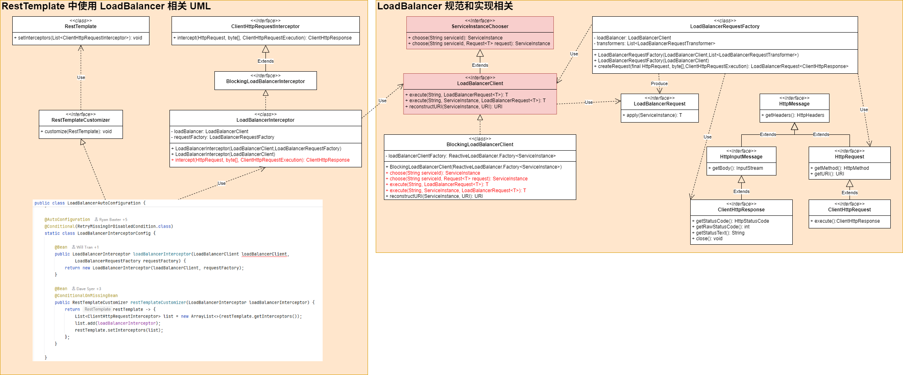

# LoadBalancer

## 一、 UML



## 二、重要类 - LoadBalancer 规范相关

### 1. ServiceInstance

```java
// org.springframework.cloud.client.ServiceInstance
// 表示发现系统中服务的一个实例。
public interface ServiceInstance {

	// @return 注册的唯一实例 ID。
	default String getInstanceId() {
		return null;
	}

	// @return 注册的服务 ID。
	String getServiceId();

	// @return 已注册服务实例的主机名。
	String getHost();

	// @return 已注册服务实例的端口。
	int getPort();

	// @return 已注册服务实例的端口是否使用 HTTPS。
	boolean isSecure();

	// @return 服务 URI 地址。
	URI getUri();

	// @return 与服务实例关联的键/值对元数据。
	Map<String, String> getMetadata();
	// @return 服务实例的 scheme。
	default String getScheme() {
		return null;
	}

}
```

### 2. ServiceInstanceChooser

```java
// org.springframework.cloud.client.loadbalancer.ServiceInstanceChooser
// 由使用负载平衡器选择要向其发送请求的服务器的类实现。
public interface ServiceInstanceChooser {

    // 从 LoadBalancer 中为指定服务选择一个 ServiceInstance。
    // @param serviceId 用于查找 LoadBalancer 的服务 ID。
    // @return 与 serviceId 匹配的 ServiceInstance。
    ServiceInstance choose(String serviceId);

    // 从 LoadBalancer 中为指定的服务和 LoadBalancer 请求选择一个 ServiceInstance。
    // @param serviceId 用于查找 LoadBalancer 的服务 ID。
    // @param request 要传递给 LoadBalancer 的请求。
    // @param <T> 请求上下文的类型。
    // @return 与 serviceId 匹配的 ServiceInstance。
    <T> ServiceInstance choose(String serviceId, Request<T> request);

}
```

### 3. LoadBalancerClient

```java
// org.springframework.cloud.client.loadbalancer.LoadBalancerClient
// 表示客户端负载均衡器。
public interface LoadBalancerClient extends ServiceInstanceChooser {
    
    // 使用来自 LoadBalancer 的 ServiceInstance 为指定服务执行请求。
    // @param serviceId 用于查找 LoadBalancer 的服务 ID。
    // @param request 允许实现执行前置和后置操作，例如增加指标。
    // @param <T> 响应类型
    // @throws IOException（如果出现 IO 问题）。
    // @return 所选 ServiceInstance 上 LoadBalancerRequest 回调的结果。
    <T> T execute(String serviceId, LoadBalancerRequest<T> request) throws IOException;
    
    // 使用来自 LoadBalancer 的 ServiceInstance 为指定服务执行请求。
    // @param serviceId 用于查找 LoadBalancer 的服务 ID。
    // @param serviceInstance 用于执行请求的服务。
    // @param request 允许实现执行前置和后置操作，例如增加指标。
    // @param <T> 响应类型
    // @throws IOException（如果出现 IO 问题）。
    // @return 所选 ServiceInstance 上 LoadBalancerRequest 回调的结果。
    <T> T execute(String serviceId, ServiceInstance serviceInstance, LoadBalancerRequest<T> request) throws IOException;

    // 创建一个包含真实主机和端口的正确 URI，供系统使用。
    // 某些系统使用以逻辑服务名称作为主机的 URI，例如 http://myservice/path/to/service。
    // 这将使用 ServiceInstance 中的主机:端口替换服务名称。
    // @param 实例 用于重构 URI 的服务实例
    // @param original 以主机作为逻辑服务名称的 URI。
    // @return 重构后的 URI。
    URI reconstructURI(ServiceInstance instance, URI original);

}
```

### 4. LoadBalancerRequest

```java
// org.springframework.cloud.client.loadbalancer.LoadBalancerRequest
// LoadBalancerClient 使用的简单接口，用于围绕负载均衡器请求应用指标或事前和事后操作。
public interface LoadBalancerRequest<T> {
	T apply(ServiceInstance instance) throws Exception;
}
```

#### HttpRequestLoadBalancerRequest

```java
// org.springframework.cloud.client.loadbalancer.HttpRequestLoadBalancerRequest
// 表示在 {@link HttpRequest} 之上创建的 {@link LoadBalancerRequest}。
public interface HttpRequestLoadBalancerRequest<T> extends LoadBalancerRequest<T> {
	HttpRequest getHttpRequest();
}
```

#### BlockingLoadBalancerRequest

```java
// org.springframework.cloud.client.loadbalancer.BlockingLoadBalancerRequest
// 默认的 {@link LoadBalancerRequest} 实现。
class BlockingLoadBalancerRequest implements HttpRequestLoadBalancerRequest<ClientHttpResponse> {

	private final LoadBalancerClient loadBalancer;
	private final List<LoadBalancerRequestTransformer> transformers;
	private final ClientHttpRequestData clientHttpRequestData;
    // ...

	@Override
	public ClientHttpResponse apply(ServiceInstance instance) throws Exception {
		HttpRequest serviceRequest = new ServiceRequestWrapper(clientHttpRequestData.request, instance, loadBalancer);
		if (this.transformers != null) {
			for (LoadBalancerRequestTransformer transformer : this.transformers) {
				serviceRequest = transformer.transformRequest(serviceRequest, instance);
			}
		}
		return clientHttpRequestData.execution.execute(serviceRequest, clientHttpRequestData.body);
	}
    // ...

	static class ClientHttpRequestData {
		private final HttpRequest request;
		private final byte[] body;
		private final ClientHttpRequestExecution execution;
        // ...
	}
}

// org.springframework.http.client.ClientHttpRequestExecution
@FunctionalInterface
public interface ClientHttpRequestExecution {
    ClientHttpResponse execute(HttpRequest request, byte[] body) throws IOException;
}
```

### 5. ReactiveLoadBalancer

```java
// org.springframework.cloud.client.loadbalancer.reactive.ReactiveLoadBalancer
// 响应式负载均衡器
public interface ReactiveLoadBalancer<T> {

    // 请求的默认实现
    Request<DefaultRequestContext> REQUEST = new DefaultRequest<>();

    // 根据负载均衡算法选择下一个服务器。
    @SuppressWarnings("rawtypes")
    Publisher<Response<T>> choose(Request request);

    default Publisher<Response<T>> choose() { // conflicting name
        return choose(REQUEST);
    }

    interface Factory<T> {

        default LoadBalancerProperties getProperties(String serviceId) {
            return null;
        }

        ReactiveLoadBalancer<T> getInstance(String serviceId);
        
        // 允许访问在客户端特定 LoadBalancer 上下文中注册的 bean。
        <X> Map<String, X> getInstances(String name, Class<X> type);
        
        // 允许访问在客户端特定负载均衡器上下文中注册的 bean。
        <X> X getInstance(String name, Class<?> clazz, Class<?>... generics);

    }
}
```

## 三、重要类 - RestTemplate 之 LoadBalancer 相关

```properties
# spring-cloud-commons/src/main/resources/META-INF/spring/org.springframework.boot.autoconfigure.AutoConfiguration.imports
org.springframework.cloud.client.loadbalancer.LoadBalancerAutoConfiguration
```

### 1. LoadBalancerAutoConfiguration

```java
// org.springframework.cloud.client.loadbalancer.LoadBalancerAutoConfiguration
// 自动配置阻止客户端负载平衡。
@AutoConfiguration
@Conditional(BlockingRestClassesPresentCondition.class)
@ConditionalOnBean(LoadBalancerClient.class)
@EnableConfigurationProperties(LoadBalancerClientsProperties.class)
public class LoadBalancerAutoConfiguration {

    @LoadBalanced
    @Autowired(required = false)
    private List<RestTemplate> restTemplates = Collections.emptyList();

    @Autowired(required = false)
    private List<LoadBalancerRequestTransformer> transformers = Collections.emptyList();

    @Bean
    public SmartInitializingSingleton loadBalancedRestTemplateInitializerDeprecated(
            ObjectProvider<List<RestTemplateCustomizer>> restTemplateCustomizers) {
        return () -> restTemplateCustomizers.ifAvailable(customizers -> {
            for (RestTemplate restTemplate : restTemplates) {
                for (RestTemplateCustomizer customizer : customizers) {
                    customizer.customize(restTemplate);
                }
            }
        });
    }
    // ...

    @AutoConfiguration
    @Conditional(RetryMissingOrDisabledCondition.class)
    static class LoadBalancerInterceptorConfig {

        @Bean
        public LoadBalancerInterceptor loadBalancerInterceptor(LoadBalancerClient loadBalancerClient,
                                                               LoadBalancerRequestFactory requestFactory) {
            return new LoadBalancerInterceptor(loadBalancerClient, requestFactory);
        }

        @Bean
        @ConditionalOnMissingBean
        public RestTemplateCustomizer restTemplateCustomizer(LoadBalancerInterceptor loadBalancerInterceptor) {
            return restTemplate -> {
                List<ClientHttpRequestInterceptor> list = new ArrayList<>(restTemplate.getInterceptors());
                list.add(loadBalancerInterceptor);
                restTemplate.setInterceptors(list);
            };
        }
    }
    // ...
}
```

### 2. RestTemplateCustomizer

```java
// org.springframework.cloud.client.loadbalancer.RestTemplateCustomizer
public interface RestTemplateCustomizer {
	void customize(RestTemplate restTemplate);
}
```

### 3. LoadBalancerInterceptor

```java
// 1. org.springframework.cloud.client.loadbalancer.LoadBalancerInterceptor
public class LoadBalancerInterceptor implements BlockingLoadBalancerInterceptor {

	private final LoadBalancerClient loadBalancer;

	private final LoadBalancerRequestFactory requestFactory;

	public LoadBalancerInterceptor(LoadBalancerClient loadBalancer, LoadBalancerRequestFactory requestFactory) {
		this.loadBalancer = loadBalancer;
		this.requestFactory = requestFactory;
	}

	public LoadBalancerInterceptor(LoadBalancerClient loadBalancer) {
		// for backwards compatibility
		this(loadBalancer, new LoadBalancerRequestFactory(loadBalancer));
	}

	@Override
	public ClientHttpResponse intercept(HttpRequest request, byte[] body, ClientHttpRequestExecution execution)
			throws IOException {
		URI originalUri = request.getURI();
		String serviceName = originalUri.getHost();
		Assert.state(serviceName != null, "Request URI does not contain a valid hostname: " + originalUri);
		return loadBalancer.execute(serviceName, requestFactory.createRequest(request, body, execution));
	}
}

// 2. org.springframework.cloud.client.loadbalancer.BlockingLoadBalancerInterceptor
// 用于负载平衡的 {@link ClientHttpRequestInterceptor} 实例的标记接口。
public interface BlockingLoadBalancerInterceptor extends ClientHttpRequestInterceptor {

}

// 3. org.springframework.http.client.ClientHttpRequestInterceptor
@FunctionalInterface
public interface ClientHttpRequestInterceptor {
    ClientHttpResponse intercept(HttpRequest request, byte[] body, ClientHttpRequestExecution execution) throws IOException;
}
```

## 四、重要类 - 于 spring-cloud-loadbalancer 模块中的实现类

### 1. BlockingLoadBalancerClient

```java
// org.springframework.cloud.loadbalancer.blocking.client.BlockingLoadBalancerClient
// 默认的 {@link LoadBalancerClient} 实现。
@SuppressWarnings({ "unchecked", "rawtypes" })
public class BlockingLoadBalancerClient implements LoadBalancerClient {

    private final ReactiveLoadBalancer.Factory<ServiceInstance> loadBalancerClientFactory;

    public BlockingLoadBalancerClient(ReactiveLoadBalancer.Factory<ServiceInstance> loadBalancerClientFactory) {
        this.loadBalancerClientFactory = loadBalancerClientFactory;
    }

    // 相关类：LoadBalancerRequestAdapter、LoadBalancerLifecycle
    @Override
    public <T> T execute(String serviceId, LoadBalancerRequest<T> request) throws IOException {
        String hint = getHint(serviceId);
        LoadBalancerRequestAdapter<T, TimedRequestContext> lbRequest = new LoadBalancerRequestAdapter<>(request,
                buildRequestContext(request, hint));
        Set<LoadBalancerLifecycle> supportedLifecycleProcessors = getSupportedLifecycleProcessors(serviceId);
        supportedLifecycleProcessors.forEach(lifecycle -> lifecycle.onStart(lbRequest));
        ServiceInstance serviceInstance = choose(serviceId, lbRequest);
        if (serviceInstance == null) {
            supportedLifecycleProcessors.forEach(lifecycle -> lifecycle
                    .onComplete(new CompletionContext<>(CompletionContext.Status.DISCARD, lbRequest, new EmptyResponse())));
            throw new IllegalStateException("No instances available for " + serviceId);
        }
        return execute(serviceId, serviceInstance, lbRequest);
    }

    // ...

    @Override
    public <T> T execute(String serviceId, ServiceInstance serviceInstance, LoadBalancerRequest<T> request)
            throws IOException {
        if (serviceInstance == null) {
            throw new IllegalArgumentException("Service Instance cannot be null, serviceId: " + serviceId);
        }
        DefaultResponse defaultResponse = new DefaultResponse(serviceInstance);
        Set<LoadBalancerLifecycle> supportedLifecycleProcessors = getSupportedLifecycleProcessors(serviceId);
        Request lbRequest = request instanceof Request ? (Request) request : new DefaultRequest<>();
        supportedLifecycleProcessors
                .forEach(lifecycle -> lifecycle.onStartRequest(lbRequest, new DefaultResponse(serviceInstance)));
        try {
            T response = request.apply(serviceInstance);
            Object clientResponse = getClientResponse(response);
            supportedLifecycleProcessors
                    .forEach(lifecycle -> lifecycle.onComplete(new CompletionContext<>(CompletionContext.Status.SUCCESS,
                            lbRequest, defaultResponse, clientResponse)));
            return response;
        }
        catch (IOException iOException) {
            supportedLifecycleProcessors.forEach(lifecycle -> lifecycle.onComplete(
                    new CompletionContext<>(CompletionContext.Status.FAILED, iOException, lbRequest, defaultResponse)));
            throw iOException;
        }
        catch (Exception exception) {
            supportedLifecycleProcessors.forEach(lifecycle -> lifecycle.onComplete(
                    new CompletionContext<>(CompletionContext.Status.FAILED, exception, lbRequest, defaultResponse)));
            ReflectionUtils.rethrowRuntimeException(exception);
        }
        return null;
    }

    // ...

    @Override
    public ServiceInstance choose(String serviceId) {
        return choose(serviceId, REQUEST);
    }

    @Override
    public <T> ServiceInstance choose(String serviceId, Request<T> request) {
        ReactiveLoadBalancer<ServiceInstance> loadBalancer = loadBalancerClientFactory.getInstance(serviceId);
        if (loadBalancer == null) {
            return null;
        }
        Response<ServiceInstance> loadBalancerResponse = Mono.from(loadBalancer.choose(request)).block();
        if (loadBalancerResponse == null) {
            return null;
        }
        return loadBalancerResponse.getServer();
    }

    // ...

}
```

### 2. ServiceInstanceListSupplier

```java
// org.springframework.cloud.loadbalancer.core.ServiceInstanceListSupplier
// 一个包含 {@link ServiceInstance} 对象列表的 {@link Supplier}。
public interface ServiceInstanceListSupplier extends Supplier<Flux<List<ServiceInstance>>> {

	String getServiceId();

	default Flux<List<ServiceInstance>> get(Request request) {
		return get();
	}

	static ServiceInstanceListSupplierBuilder builder() {
		return new ServiceInstanceListSupplierBuilder();
	}

}
```

#### 一些实现类

##### DelegatingServiceInstanceListSupplier

```java
// org.springframework.cloud.loadbalancer.core.DelegatingServiceInstanceListSupplier
public abstract class DelegatingServiceInstanceListSupplier
		implements ServiceInstanceListSupplier, SelectedInstanceCallback, InitializingBean, DisposableBean {

    protected final ServiceInstanceListSupplier delegate;
    // ...
}
```

##### NoopServiceInstanceListSupplier

```java
// org.springframework.cloud.loadbalancer.core.NoopServiceInstanceListSupplier
// {@link ServiceInstanceListSupplier} 的空操作实现。
public class NoopServiceInstanceListSupplier implements ServiceInstanceListSupplier {

    @Override
    public String getServiceId() {
        return "";
    }

    @Override
    public Flux<List<ServiceInstance>> get() {
        return Flux.defer(() -> Flux.just(Collections.emptyList()));
    }

    @Override
    public Flux<List<ServiceInstance>> get(Request request) {
        return Flux.defer(() -> Flux.just(Collections.emptyList()));
    }

}
```

##### DiscoveryClientServiceInstanceListSupplier

```java
// org.springframework.cloud.loadbalancer.core.DiscoveryClientServiceInstanceListSupplier
// discovery-client-based 的 {@link ServiceInstanceListSupplier} 实现。
public class DiscoveryClientServiceInstanceListSupplier implements ServiceInstanceListSupplier {

    // 设置服务发现调用超时时间的属性。
    public static final String SERVICE_DISCOVERY_TIMEOUT = "spring.cloud.loadbalancer.service-discovery.timeout";

    private static final Log LOG = LogFactory.getLog(DiscoveryClientServiceInstanceListSupplier.class);

    private Duration timeout = Duration.ofSeconds(30);

    private final String serviceId;

    private final Flux<List<ServiceInstance>> serviceInstances;

    public DiscoveryClientServiceInstanceListSupplier(DiscoveryClient delegate, Environment environment) {
        this.serviceId = environment.getProperty(PROPERTY_NAME);
        resolveTimeout(environment);
        this.serviceInstances = Flux.defer(() -> Mono.fromCallable(() -> delegate.getInstances(serviceId)))
                .timeout(timeout, Flux.defer(() -> {
                    logTimeout();
                    return Flux.just(new ArrayList<>());
                }), Schedulers.boundedElastic())
                .onErrorResume(error -> {
                    logException(error);
                    return Flux.just(new ArrayList<>());
                });
    }
    // ...
}
```

#### 一些工具类

##### ServiceInstanceListSupplierBuilder

```java
// org.springframework.cloud.loadbalancer.core.ServiceInstanceListSupplierBuilder
// see ServiceInstanceListSupplier#builder()
// 用于创建 {@link ServiceInstanceListSupplier} 层次结构的构建器，该层次结构将在 {@link ReactorLoadBalancer} 配置中使用。
public final class ServiceInstanceListSupplierBuilder {
    // ...
    
    // 在层次结构中，将阻塞的基于 {@link DiscoveryClient} 的
    // {@link DiscoveryClientServiceInstanceListSupplier} 设置为基本 {@link ServiceInstanceListSupplier}。
    public ServiceInstanceListSupplierBuilder withBlockingDiscoveryClient() {
        if (baseCreator != null && LOG.isWarnEnabled()) {
            LOG.warn("Overriding a previously set baseCreator with a blocking DiscoveryClient baseCreator.");
        }
        this.baseCreator = context -> {
            DiscoveryClient discoveryClient = context.getBean(DiscoveryClient.class);

            return new DiscoveryClientServiceInstanceListSupplier(discoveryClient, context.getEnvironment());
        };
        return this;
    }
    // ...
}
```

##### ServiceInstanceListSuppliers

```java
// org.springframework.cloud.loadbalancer.support.ServiceInstanceListSuppliers
// 用于服务实例列表供应商的实用程序类。
public final class ServiceInstanceListSuppliers {

	private ServiceInstanceListSuppliers() {
		throw new IllegalStateException("Can't instantiate a utility class");
	}

	public static ServiceInstanceListSupplier from(String serviceId, ServiceInstance... instances) {
		return new ServiceInstanceListSupplier() {
			@Override
			public Flux<List<ServiceInstance>> get() {
				return Flux.just(Arrays.asList(instances));
			}

			@Override
			public String getServiceId() {
				return serviceId;
			}
		};
	}

	public static ObjectProvider<ServiceInstanceListSupplier> toProvider(String serviceId,
			ServiceInstance... instances) {
		return new SimpleObjectProvider<>(from(serviceId, instances));
	}

}
```


### 3. ReactorLoadBalancer

```java
// org.springframework.cloud.loadbalancer.core.ReactorLoadBalancer
// 基于 Reactor 的 {@link ReactiveLoadBalancer} 实现。
public interface ReactorLoadBalancer<T> extends ReactiveLoadBalancer<T> {
    // 根据负载均衡算法选择下一个服务器。
    Mono<Response<T>> choose(Request request);

    default Mono<Response<T>> choose() {
        return choose(REQUEST);
    }
}
```

#### ReactorServiceInstanceLoadBalancer

```java
// 1. org.springframework.cloud.loadbalancer.core.ReactorServiceInstanceLoadBalancer
// 一个用于 {@link ReactorLoadBalancer} 的标记接口，允许选择 {@link ServiceInstance} 对象。
public interface ReactorServiceInstanceLoadBalancer extends ReactorLoadBalancer<ServiceInstance> {

}

// 2. org.springframework.cloud.loadbalancer.core.RandomLoadBalancer
public class RandomLoadBalancer implements ReactorServiceInstanceLoadBalancer {
    private final String serviceId;
    private ObjectProvider<ServiceInstanceListSupplier> serviceInstanceListSupplierProvider;

    // ...
    @SuppressWarnings("rawtypes")
    @Override
    public Mono<Response<ServiceInstance>> choose(Request request) {
        ServiceInstanceListSupplier supplier = serviceInstanceListSupplierProvider
                .getIfAvailable(NoopServiceInstanceListSupplier::new);
        return supplier.get(request)
                .next()
                .map(serviceInstances -> processInstanceResponse(supplier, serviceInstances));
    }
    // ...
}

// 3. org.springframework.cloud.loadbalancer.core.RoundRobinLoadBalancer
public class RoundRobinLoadBalancer implements ReactorServiceInstanceLoadBalancer {
    // ... 算法不同，其他相同
}
```


## 五、LoadBalancerAutoConfiguration 变化

### Spring Cloud Commons 1.0.x

```java
@Configuration
@ConditionalOnClass(RestTemplate.class)
@ConditionalOnBean(LoadBalancerClient.class)
public class LoadBalancerAutoConfiguration {

	@Bean
    @LoadBalanced
	public RestTemplate loadBalancedRestTemplate(RestTemplateCustomizer customizer) {
		RestTemplate restTemplate = new RestTemplate();
        customizer.customize(restTemplate);
		return restTemplate;
	}

    @Bean
    @ConditionalOnMissingBean
    public RestTemplateCustomizer restTemplateCustomizer(final LoadBalancerInterceptor loadBalancerInterceptor) {
        return new RestTemplateCustomizer() {
            @Override
            public void customize(RestTemplate restTemplate) {
                List<ClientHttpRequestInterceptor> list = new ArrayList<>();
                list.add(loadBalancerInterceptor);
                restTemplate.setInterceptors(list);
            }
        };
    }

	@Bean
	public LoadBalancerInterceptor ribbonInterceptor(LoadBalancerClient loadBalancerClient) {
		return new LoadBalancerInterceptor(loadBalancerClient);
	}

}
```

### Spring Cloud Commons 4.0.x

类似，只是支持了对多个 RestTemplate 进行负载均衡设置。具体可参考源码中的 LoadBalancerAutoConfiguration 类。


## 六、使用示例

### 复杂实现

伪代码：

```java
class XxxLoadBalancerRequest implements HttpRequestLoadBalancerRequest<ClientHttpResponse> {
    // ...
    @Override
    public ClientHttpResponse apply(ServiceInstance instance) throws Exception {
        // ...
    }
    // ...
}

class XxxLoadBalancerClient implements LoadBalancerClient {
    
    // ...
    @Override
    public <T> T execute(String serviceId, LoadBalancerRequest<T> request) throws IOException {
        // ...
        LoadBalancerRequest lbRequest = new XxxLoadBalancerRequest();
        ServiceInstance serviceInstance = choose(serviceId, lbRequest);
        // ...
        return execute(serviceId, serviceInstance, lbRequest);
    }

    // ...
    @Override
    public <T> T execute(String serviceId, ServiceInstance serviceInstance, LoadBalancerRequest<T> request)
            throws IOException {
        // ...
        Request lbRequest = request instanceof Request ? (Request) request : new DefaultRequest<>();
        supportedLifecycleProcessors
                .forEach(lifecycle -> lifecycle.onStartRequest(lbRequest, new DefaultResponse(serviceInstance)));
        try {
            T response = request.apply(serviceInstance);
            Object clientResponse = getClientResponse(response);
            supportedLifecycleProcessors
                    .forEach(lifecycle -> lifecycle.onComplete(new CompletionContext<>(CompletionContext.Status.SUCCESS,
                            lbRequest, defaultResponse, clientResponse)));
            return response;
        }
        // ...
    }
    // ...
}


// 使用
LoadBalancerClient loadBalancerClient = new XxxLoadBalancerClient();
loadBalancerClient.execute(...);
```

### 基于 spring-cloud-loadbalancer 的实现

```java
public class XxxLoadBalancer implements ReactorServiceInstanceLoadBalancer {
    // ...
}

@Configuration(proxyBeanMethods = false)
@ConditionalOnDiscoveryEnabled
public class NacosLoadBalancerClientConfiguration {
    @Bean
    @ConditionalOnMissingBean
    public ReactorLoadBalancer<ServiceInstance> xxxLoadBalancer() {
        return new XxxLoadBalancer();
    }
}

// 使用
LoadBalancerClient loadBalancerClient = new BlockingLoadBalancerClient();
loadBalancerClient.execute(...);
```

## 七、 实际使用

### 在 spring-cloud-starter-alibaba-nacos-discovery 中的使用

```java
public class NacosLoadBalancer implements ReactorServiceInstanceLoadBalancer {
    // ...
}

@Configuration(proxyBeanMethods = false)
@ConditionalOnDiscoveryEnabled
public class NacosLoadBalancerClientConfiguration {

    private static final int REACTIVE_SERVICE_INSTANCE_SUPPLIER_ORDER = 183827465;

    @Bean
    @ConditionalOnMissingBean
    public ReactorLoadBalancer<ServiceInstance> nacosLoadBalancer(Environment environment,
                                                                  LoadBalancerClientFactory loadBalancerClientFactory,
                                                                  NacosDiscoveryProperties nacosDiscoveryProperties) {
        String name = environment.getProperty(LoadBalancerClientFactory.PROPERTY_NAME);
        return new NacosLoadBalancer(
                loadBalancerClientFactory.getLazyProvider(name,
                        ServiceInstanceListSupplier.class),
                name, nacosDiscoveryProperties);
    }
    // ...
}
```