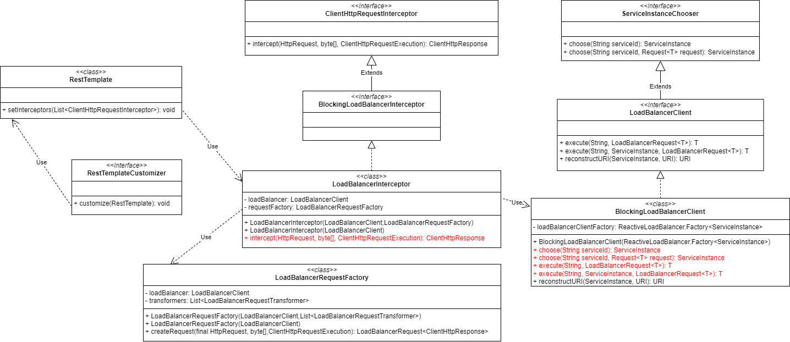

# LoadBalancer

## 一、重要类



### 1. LoadBalancerAutoConfiguration

#### Spring Cloud Commons 1.0.x

```java
@Configuration
@ConditionalOnClass(RestTemplate.class)
@ConditionalOnBean(LoadBalancerClient.class)
public class LoadBalancerAutoConfiguration {

	@Bean
    @LoadBalanced
	public RestTemplate loadBalancedRestTemplate(RestTemplateCustomizer customizer) {
		RestTemplate restTemplate = new RestTemplate();
        customizer.customize(restTemplate);
		return restTemplate;
	}

    @Bean
    @ConditionalOnMissingBean
    public RestTemplateCustomizer restTemplateCustomizer(final LoadBalancerInterceptor loadBalancerInterceptor) {
        return new RestTemplateCustomizer() {
            @Override
            public void customize(RestTemplate restTemplate) {
                List<ClientHttpRequestInterceptor> list = new ArrayList<>();
                list.add(loadBalancerInterceptor);
                restTemplate.setInterceptors(list);
            }
        };
    }

	@Bean
	public LoadBalancerInterceptor ribbonInterceptor(LoadBalancerClient loadBalancerClient) {
		return new LoadBalancerInterceptor(loadBalancerClient);
	}

}
```

#### Spring Cloud Commons 4.0.x

类似，只是支持了对多个 RestTemplate 进行负载均衡设置。具体可参考源码中的 LoadBalancerAutoConfiguration 类。

### 2. RestTemplate

```java
// RestTemplate
public class RestTemplate extends InterceptingHttpAccessor implements RestOperations {
    // ...
}

// InterceptingHttpAccessor
public abstract class InterceptingHttpAccessor extends HttpAccessor {
    private final List<ClientHttpRequestInterceptor> interceptors = new ArrayList();
    
    // ...
    public void setInterceptors(List<ClientHttpRequestInterceptor> interceptors) {
        Assert.noNullElements(interceptors, "'interceptors' must not contain null elements");
        if (this.interceptors != interceptors) {
            this.interceptors.clear();
            this.interceptors.addAll(interceptors);
            AnnotationAwareOrderComparator.sort(this.interceptors);
        }

    }

    // ...
}
```

以上代码中，最重要的类方法就是 `org.springframework.http.client.support.InterceptingHttpAccessor#setInterceptors()`。

### 2. LoadBalancerInterceptor

```java
// BlockingLoadBalancerInterceptor
public interface BlockingLoadBalancerInterceptor extends ClientHttpRequestInterceptor {}

// LoadBalancerInterceptor
public class LoadBalancerInterceptor implements BlockingLoadBalancerInterceptor {

	private final LoadBalancerClient loadBalancer;

	private final LoadBalancerRequestFactory requestFactory;

	public LoadBalancerInterceptor(LoadBalancerClient loadBalancer, LoadBalancerRequestFactory requestFactory) {
		this.loadBalancer = loadBalancer;
		this.requestFactory = requestFactory;
	}

	public LoadBalancerInterceptor(LoadBalancerClient loadBalancer) {
		// for backwards compatibility
		this(loadBalancer, new LoadBalancerRequestFactory(loadBalancer));
	}

	@Override
	public ClientHttpResponse intercept(HttpRequest request, byte[] body, ClientHttpRequestExecution execution)
			throws IOException {
		URI originalUri = request.getURI();
		String serviceName = originalUri.getHost();
		Assert.state(serviceName != null, "Request URI does not contain a valid hostname: " + originalUri);
		return loadBalancer.execute(serviceName, requestFactory.createRequest(request, body, execution));
	}

}
```

以上代码中，最重要的类方法就是 `org.springframework.cloud.client.loadbalancer.LoadBalancerInterceptor#intercept()`。

### 3. BlockingLoadBalancerClient

```java
// 1. ServiceInstanceChooser
// 由使用负载平衡器选择要向其发送请求的服务器的类实现。
public interface ServiceInstanceChooser {

    // 从 LoadBalancer 中为指定服务选择一个 ServiceInstance。
    // @param serviceId 用于查找 LoadBalancer 的服务 ID。
    // @return 与 serviceId 匹配的 ServiceInstance。
    ServiceInstance choose(String serviceId);

    // 从 LoadBalancer 中为指定的服务和 LoadBalancer 请求选择一个 ServiceInstance。
    // @param serviceId 用于查找 LoadBalancer 的服务 ID。
    // @param request 要传递给 LoadBalancer 的请求。
    // @param <T> 请求上下文的类型。
    // @return 与 serviceId 匹配的 ServiceInstance。
    <T> ServiceInstance choose(String serviceId, Request<T> request);

}

// 2. LoadBalancerClient
// 表示客户端负载均衡器。
public interface LoadBalancerClient extends ServiceInstanceChooser {
    
    // 使用来自 LoadBalancer 的 ServiceInstance 为指定服务执行请求。
    // @param serviceId 用于查找 LoadBalancer 的服务 ID。
    // @param request 允许实现执行前置和后置操作，例如增加指标。
    // @param <T> 响应类型
    // @throws IOException（如果出现 IO 问题）。
    // @return 所选 ServiceInstance 上 LoadBalancerRequest 回调的结果。
    <T> T execute(String serviceId, LoadBalancerRequest<T> request) throws IOException;
    
    // 使用来自 LoadBalancer 的 ServiceInstance 为指定服务执行请求。
    // @param serviceId 用于查找 LoadBalancer 的服务 ID。
    // @param serviceInstance 用于执行请求的服务。
    // @param request 允许实现执行前置和后置操作，例如增加指标。
    // @param <T> 响应类型
    // @throws IOException（如果出现 IO 问题）。
    // @return 所选 ServiceInstance 上 LoadBalancerRequest 回调的结果。
    <T> T execute(String serviceId, ServiceInstance serviceInstance, LoadBalancerRequest<T> request) throws IOException;

    // 创建一个包含真实主机和端口的正确 URI，供系统使用。
    // 某些系统使用以逻辑服务名称作为主机的 URI，例如 http://myservice/path/to/service。
    // 这将使用 ServiceInstance 中的主机:端口替换服务名称。
    // @param 实例 用于重构 URI 的服务实例
    // @param original 以主机作为逻辑服务名称的 URI。
    // @return 重构后的 URI。
    URI reconstructURI(ServiceInstance instance, URI original);

}

// 3. BlockingLoadBalancerClient
public class BlockingLoadBalancerClient implements LoadBalancerClient {
    // ...
    @Override
    public <T> T execute(String serviceId, LoadBalancerRequest<T> request) throws IOException {
        String hint = getHint(serviceId);
        LoadBalancerRequestAdapter<T, TimedRequestContext> lbRequest = new LoadBalancerRequestAdapter<>(request,
                buildRequestContext(request, hint));
        Set<LoadBalancerLifecycle> supportedLifecycleProcessors = getSupportedLifecycleProcessors(serviceId);
        supportedLifecycleProcessors.forEach(lifecycle -> lifecycle.onStart(lbRequest));
        ServiceInstance serviceInstance = choose(serviceId, lbRequest);
        if (serviceInstance == null) {
            supportedLifecycleProcessors.forEach(lifecycle -> lifecycle
                    .onComplete(new CompletionContext<>(CompletionContext.Status.DISCARD, lbRequest, new EmptyResponse())));
            throw new IllegalStateException("No instances available for " + serviceId);
        }
        return execute(serviceId, serviceInstance, lbRequest);
    }
    // ...

    @Override
    public <T> T execute(String serviceId, ServiceInstance serviceInstance, LoadBalancerRequest<T> request)
            throws IOException {
        // ...
    }
}
```

以上代码中，最重要的类方法就是 `org.springframework.cloud.loadbalancer.blocking.client.BlockingLoadBalancerClient#execute(java.lang.String, org.springframework.cloud.client.loadbalancer.LoadBalancerRequest<T>)`。


## 二、使用示例

伪代码：

```java
class XxxLoadBalancerClient implements LoadBalancerClient {
    
    // ...
    @Override
    public <T> T execute(String serviceId, LoadBalancerRequest<T> request) throws IOException {
        // ...
        ServiceInstance serviceInstance = choose(serviceId, lbRequest);
        // ...
        return execute(serviceId, serviceInstance, lbRequest);
    }

    // ...
    @Override
    public <T> T execute(String serviceId, ServiceInstance serviceInstance, LoadBalancerRequest<T> request)
            throws IOException {
        // ...
    }
    // ...
}

// 使用
LoadBalancerClient loadBalancerClient = new XxxLoadBalancerClient();
loadBalancerClient.execute(...);
```

## 