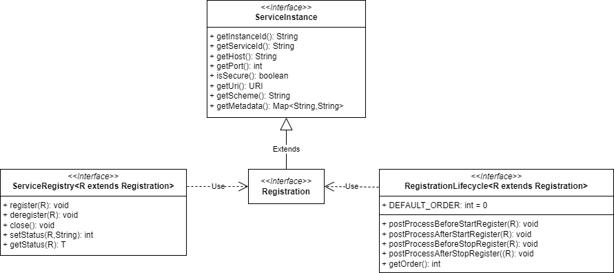
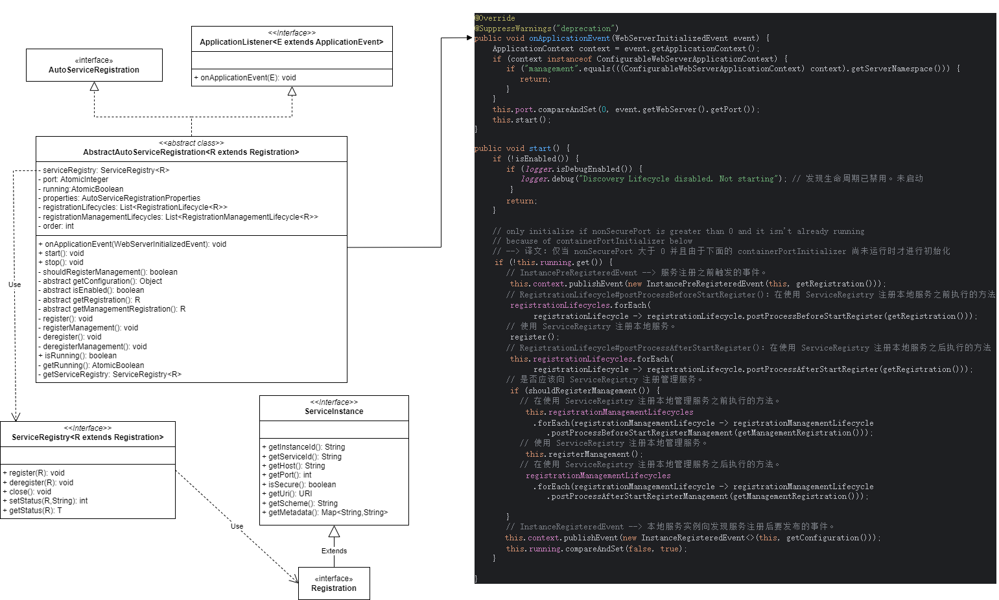

# Service Registry

## 一、Service Registry

简介

## 二、重要类 - 服务注册相关类



### 1. Registration（向服务注册中心注册的服务信息）

```java
// org.springframework.cloud.client.serviceregistry.Registration
// 由 ServiceRegistry 使用的标记接口
public interface Registration extends ServiceInstance {}

// org.springframework.cloud.client.ServiceInstance
// 表示发现系统中服务的一个实例
public interface ServiceInstance {
    
    // @return 注册的唯一实例 ID。
    default String getInstanceId() {
        return null;
    }
    
    // @return 注册的服务 ID。
    String getServiceId();
    
    // @return 已注册服务实例的主机名。
    String getHost();
    
    // @return 已注册服务实例的端口。
    int getPort();
    
    // @return 已注册服务实例的端口是否使用 HTTPS。
    boolean isSecure();
    
    // @return 服务 URI 地址。
    URI getUri();
    
    // @return 与服务实例关联的键/值对元数据。
    Map<String, String> getMetadata();
    
    // @return 服务实例的 scheme。
    default String getScheme() {
        return null;
    }
}
```

### 2. ServiceRegistry（服务注册中心）

```java
// 签订合同以向服务注册表注册和注销实例。
public interface ServiceRegistry<R extends Registration> {
    
	// 注册注册信息。注册信息通常包含实例的相关信息，例如主机名和端口。
	void register(R registration);
    
	// 注销注册信息。
	void deregister(R registration);
    
	// 关闭 ServiceRegistry。这是一个生命周期方法。
	void close();
    
	// 设置注册状态。状态值由各个实现决定。
	void setStatus(R registration, String status);
    
	// 获取特定注册的状态。
	<T> T getStatus(R registration);

}
```

### 3. RegistrationLifecycle（服务注册生命周期）

```java
// 服务注册生命周期。此生命周期仅与 {@link Registration} 相关。
public interface RegistrationLifecycle<R extends Registration> extends Ordered {

	// 默认顺序。
	int DEFAULT_ORDER = 0;

	// 在使用 {@link ServiceRegistry} 注册本地服务之前执行的方法。
	void postProcessBeforeStartRegister(R registration);

	// 在使用 {@link ServiceRegistry} 注册本地服务之后执行的方法。
	void postProcessAfterStartRegister(R registration);

	// 在使用 {@link ServiceRegistry} 取消注册本地服务之前执行的方法。
	void postProcessBeforeStopRegister(R registration);

	// 在使用 {@link ServiceRegistry} 取消注册本地服务之后执行的方法。
	void postProcessAfterStopRegister(R registration);

	default int getOrder() {
		return DEFAULT_ORDER;
	}
}
```

## 三、重要类 - 服务自动注册相关类（本机服务自动注册到服务注册表）



```properties
# spring-cloud-commons/src/main/resources/META-INF/spring/org.springframework.boot.autoconfigure.AutoConfiguration.imports
org.springframework.cloud.client.serviceregistry.AutoServiceRegistrationAutoConfiguration
```

### 1. AutoServiceRegistrationAutoConfiguration

```java
// org.springframework.cloud.client.serviceregistry.AutoServiceRegistrationAutoConfiguration
@Configuration(proxyBeanMethods = false)
@Import(AutoServiceRegistrationConfiguration.class)
@ConditionalOnProperty(value = "spring.cloud.service-registry.auto-registration.enabled", matchIfMissing = true)
public class AutoServiceRegistrationAutoConfiguration implements InitializingBean {

    @Autowired(required = false)
    private AutoServiceRegistration autoServiceRegistration;

    @Autowired
    private AutoServiceRegistrationProperties properties;

    @Override
    public void afterPropertiesSet() {
        if (this.autoServiceRegistration == null && this.properties.isFailFast()) {
            // 已请求自动服务注册，但不存在 AutoServiceRegistration bean
            throw new IllegalStateException(
                    "Auto Service Registration has " + "been requested, but there is no AutoServiceRegistration bean");
        }
    }
}

// 2. org.springframework.cloud.client.serviceregistry.AutoServiceRegistrationConfiguration
@Configuration(proxyBeanMethods = false)
@EnableConfigurationProperties(AutoServiceRegistrationProperties.class)
@ConditionalOnProperty(value = "spring.cloud.service-registry.auto-registration.enabled", matchIfMissing = true)
public class AutoServiceRegistrationConfiguration {

}
```

### 2. AutoServiceRegistrationProperties

```java
// org.springframework.cloud.client.serviceregistry.AutoServiceRegistrationProperties
@ConfigurationProperties("spring.cloud.service-registry.auto-registration")
public class AutoServiceRegistrationProperties {

    /** Whether service auto-registration is enabled. Defaults to true. */
    // 是否启用服务自动注册。默认为 true。
    private boolean enabled = true;

    /** Whether to register the management as a service. Defaults to true. */
    // 是否将管理注册为服务。默认为 true。
    private boolean registerManagement = true;

    /**
     * Whether startup fails if there is no AutoServiceRegistration. Defaults to false.
     */
    // 如果没有 AutoServiceRegistration，启动是否失败。默认为 false。
    private boolean failFast = false;
    // ...
}
```

### 3. RegistrationManagementLifecycle

```java
// 服务注册生命周期。此生命周期仅与 {@link
// org.springframework.cloud.client.serviceregistry.AbstractAutoServiceRegistration#getManagementRegistration()}
// 相关。
public interface RegistrationManagementLifecycle<R extends Registration> extends RegistrationLifecycle<R> {

	// 在使用 {@link ServiceRegistry} 注册本地管理服务之前执行的方法。
	void postProcessBeforeStartRegisterManagement(R registrationManagement);

	// 在使用 {@link ServiceRegistry} 注册本地管理服务之后执行的方法。
	void postProcessAfterStartRegisterManagement(R registrationManagement);

	// 在使用 {@link ServiceRegistry} 取消注册管理本地服务之前执行的方法。
	void postProcessBeforeStopRegisterManagement(R registrationManagement);

	// 在使用 {@link ServiceRegistry} 取消注册管理本地服务之后执行的方法。
	void postProcessAfterStopRegisterManagement(R registrationManagement);
}
```

### 4. AutoServiceRegistration

```java
// org.springframework.cloud.client.serviceregistry.AutoServiceRegistration
public interface AutoServiceRegistration {

}

// org.springframework.cloud.client.serviceregistry.AbstractAutoServiceRegistration
public abstract class AbstractAutoServiceRegistration<R extends Registration>
        implements AutoServiceRegistration, ApplicationContextAware, ApplicationListener<WebServerInitializedEvent> {

    // ...
    private final ServiceRegistry<R> serviceRegistry;
    // ...

    protected AbstractAutoServiceRegistration(ServiceRegistry<R> serviceRegistry,
                                              AutoServiceRegistrationProperties properties) {
        this.serviceRegistry = serviceRegistry;
        this.properties = properties;
    }
    
    // ...
    @Override
    @SuppressWarnings("deprecation")
    public void onApplicationEvent(WebServerInitializedEvent event) {
        // ...
        this.start();
    }
    // ...

    public void start() {
        if (!isEnabled()) {
            if (logger.isDebugEnabled()) {
                logger.debug("Discovery Lifecycle disabled. Not starting"); // 发现生命周期已禁用。未启动
            }
            return;
        }

        // only initialize if nonSecurePort is greater than 0 and it isn't already running
        // because of containerPortInitializer below
        // --> 译文：仅当 nonSecurePort 大于 0 并且由于下面的 containerPortInitializer 尚未运行时才进行初始化
        if (!this.running.get()) {
            // InstancePreRegisteredEvent --> 服务注册之前触发的事件。
            this.context.publishEvent(new InstancePreRegisteredEvent(this, getRegistration()));
            // RegistrationLifecycle#postProcessBeforeStartRegister()：在使用 ServiceRegistry 注册本地服务之前执行的方法
            registrationLifecycles.forEach(
                    registrationLifecycle -> registrationLifecycle.postProcessBeforeStartRegister(getRegistration()));
            // 使用 ServiceRegistry 注册本地服务。
            register();
            // RegistrationLifecycle#postProcessAfterStartRegister()：在使用 ServiceRegistry 注册本地服务之后执行的方法
            this.registrationLifecycles.forEach(
                    registrationLifecycle -> registrationLifecycle.postProcessAfterStartRegister(getRegistration()));
            // 是否应该向 ServiceRegistry 注册管理服务。
            if (shouldRegisterManagement()) {
                // 在使用 ServiceRegistry 注册本地管理服务之前执行的方法。
                this.registrationManagementLifecycles
                        .forEach(registrationManagementLifecycle -> registrationManagementLifecycle
                                .postProcessBeforeStartRegisterManagement(getManagementRegistration()));
                // 使用 ServiceRegistry 注册本地管理服务。
                this.registerManagement();
                // 在使用 ServiceRegistry 注册本地管理服务之后执行的方法。
                registrationManagementLifecycles
                        .forEach(registrationManagementLifecycle -> registrationManagementLifecycle
                                .postProcessAfterStartRegisterManagement(getManagementRegistration()));

            }
            // InstanceRegisteredEvent --> 本地服务实例向发现服务注册后要发布的事件。
            this.context.publishEvent(new InstanceRegisteredEvent<>(this, getConfiguration()));
            this.running.compareAndSet(false, true);
        }

    }
    // ...
    @PreDestroy
    public void destroy() {
        stop();
    }
    
    // ...

    protected abstract R getRegistration();

    protected abstract R getManagementRegistration();

    // 使用 {@link ServiceRegistry} 注册本地服务。
    protected void register() {
        this.serviceRegistry.register(getRegistration());
    }

    // 使用 {@link ServiceRegistry} 注册本地管理服务。
    protected void registerManagement() {
        R registration = getManagementRegistration();
        if (registration != null) {
            this.serviceRegistry.register(registration);
        }
    }

    // 使用 {@link ServiceRegistry} 取消注册本地服务。
    protected void deregister() {
        this.serviceRegistry.deregister(getRegistration());
    }

    // 使用 {@link ServiceRegistry} 取消注册本地管理服务。
    protected void deregisterManagement() {
        R registration = getManagementRegistration();
        if (registration != null) {
            this.serviceRegistry.deregister(registration);
        }
    }
    
    // ...
    public void stop() {
        if (this.getRunning().compareAndSet(true, false) && isEnabled()) {

            this.registrationLifecycles.forEach(
                    registrationLifecycle -> registrationLifecycle.postProcessBeforeStopRegister(getRegistration()));
            deregister();
            this.registrationLifecycles.forEach(
                    registrationLifecycle -> registrationLifecycle.postProcessAfterStopRegister(getRegistration()));
            if (shouldRegisterManagement()) {
                this.registrationManagementLifecycles
                        .forEach(registrationManagementLifecycle -> registrationManagementLifecycle
                                .postProcessBeforeStopRegisterManagement(getManagementRegistration()));
                deregisterManagement();
                this.registrationManagementLifecycles
                        .forEach(registrationManagementLifecycle -> registrationManagementLifecycle
                                .postProcessAfterStopRegisterManagement(getManagementRegistration()));
            }
            this.serviceRegistry.close();
        }
    }
}
```


## 四、使用示例

### 1. 服务注册功能

```java
class XxxRegistration implements Registration {
    // ...
}

class XxxServiceRegistry implements ServiceRegistry<XxxRegistration> {
    // ...
    public void register(XxxRegistration registration) {
        // TODO: 注册服务信息
    }
}

// 使用示例
Registration registration = new XxxRegistration();
ServiceRegistry serviceRegistry = new XxxServiceRegistry();
serviceRegistry.register(registration);
```

### 2. 本地服务自动注册功能

```java
// 1. 服务注册信息
class XxxRegistration implements Registration {
    // ...
}

// 2. 服务注册表
class XxxServiceRegistry implements ServiceRegistry<XxxRegistration> {
    // ...
    public void register(XxxRegistration registration) {
        // TODO: 注册服务信息
    }
}

// 3. 将本机服务自动注册到服务注册表
class XxxAutoServiceRegistration extends AbstractAutoServiceRegistration {
    
    private final ServiceRegistry<R> serviceRegistry;
    
    private final XxxRegistration registration;
    
    public XxxAutoServiceRegistration(ServiceRegistry<XxxRegistration> serviceRegistry,
                                      AutoServiceRegistrationProperties properties,
                                      XxxRegistration registration) {
        super(serviceRegistry, registration);
        this.registration = registration;
    }

    @Override
    public XxxRegistration getRegistration() {
        // 服务信息，关于本机的
        // TODO 设置相关服务信息，关于本机的
        return registration;
    }

    @Override
    public XxxRegistration getManagementRegistration() {
        // 服务管理信息，关于本机的
        // TODO 设置相关服务管理信息，关于本机的
        return null;
    }
}

// 4. 自动装配类
@Configuration(proxyBeanMethods = false)
class XxxAutoServiceRegistrationAutoConfiguration {
    
    @Bean
    public XxxServiceRegistry xxxServiceRegistry() {
        return new XxxServiceRegistry();
    }

    @Bean
    public XxxRegistration xxxRegistration() {
        return new XxxRegistration();
    }

    @Bean
    @ConditionalOnBean(AutoServiceRegistrationProperties.class)
    @ConditionalOnBean(XxxServiceRegistry.class)
    @ConditionalOnBean(XxxRegistration.class)
    public XxxAutoServiceRegistration nacosAutoServiceRegistration(
            AutoServiceRegistrationProperties autoServiceRegistrationProperties,
            XxxServiceRegistry registry,
            XxxRegistration registration) {
        return new NacosAutoServiceRegistration(registry,
                autoServiceRegistrationProperties, registration);
    }
    
}
```

Nacos 官方的自动装配类：`com.alibaba.cloud.nacos.registry.NacosServiceRegistryAutoConfiguration`

## 五、实际应用

### 在 spring-cloud-starter-alibaba-nacos-discovery 中的实际应用

```text
com/alibaba/cloud/nacos/
    └── registry/
            ├── NacosAutoServiceRegistration.java
            ├── NacosRegistration.java
            ├── NacosRegistrationCustomizer.java
            ├── NacosServiceRegistry.java
            └── NacosServiceRegistryAutoConfiguration.java
```

#### NacosRegistration

```java
// com.alibaba.cloud.nacos.registry.NacosRegistration
public class NacosRegistration implements Registration { 
    // ... 
}
```

#### NacosServiceRegistry

```java
public class NacosServiceRegistry implements ServiceRegistry<Registration> {

    private static final String STATUS_UP = "UP";
    private static final String STATUS_DOWN = "DOWN";

    // ...
    private final NacosDiscoveryProperties nacosDiscoveryProperties;
    private final NacosServiceManager nacosServiceManager;

    @Override
    public void register(Registration registration) {

        if (StringUtils.isEmpty(registration.getServiceId())) {
            log.warn("No service to register for nacos client...");
            return;
        }

        NamingService namingService = namingService();
        String serviceId = registration.getServiceId();
        String group = nacosDiscoveryProperties.getGroup();

        Instance instance = getNacosInstanceFromRegistration(registration);

        try {
            namingService.registerInstance(serviceId, group, instance);
            log.info("nacos registry, {} {} {}:{} register finished", group, serviceId,
                    instance.getIp(), instance.getPort());
        } catch (Exception e) {
            if (nacosDiscoveryProperties.isFailFast()) {
                log.error("nacos registry, {} register failed...{},", serviceId,
                        registration.toString(), e);
                rethrowRuntimeException(e);
            } else {
                log.warn("Failfast is false. {} register failed...{},", serviceId,
                        registration.toString(), e);
            }
        }
    }

    @Override
    public void deregister(Registration registration) {

        log.info("De-registering from Nacos Server now...");

        if (StringUtils.isEmpty(registration.getServiceId())) {
            log.warn("No dom to de-register for nacos client...");
            return;
        }

        NamingService namingService = namingService();
        String serviceId = registration.getServiceId();
        String group = nacosDiscoveryProperties.getGroup();

        try {
            namingService.deregisterInstance(serviceId, group, registration.getHost(),
                    registration.getPort(), nacosDiscoveryProperties.getClusterName());
        } catch (Exception e) {
            log.error("ERR_NACOS_DEREGISTER, de-register failed...{},",
                    registration.toString(), e);
        }

        log.info("De-registration finished.");
    }

    @Override
    public void close() {
        try {
            nacosServiceManager.nacosServiceShutDown();
        } catch (NacosException e) {
            log.error("Nacos namingService shutDown failed", e);
        }
    }

    @Override
    public void setStatus(Registration registration, String status) {

        if (!STATUS_UP.equalsIgnoreCase(status)
                && !STATUS_DOWN.equalsIgnoreCase(status)) {
            log.warn("can't support status {},please choose UP or DOWN", status);
            return;
        }

        String serviceId = registration.getServiceId();

        Instance instance = getNacosInstanceFromRegistration(registration);

        if (STATUS_DOWN.equalsIgnoreCase(status)) {
            instance.setEnabled(false);
        } else {
            instance.setEnabled(true);
        }

        try {
            Properties nacosProperties = nacosDiscoveryProperties.getNacosProperties();
            nacosServiceManager.getNamingMaintainService(nacosProperties).updateInstance(
                    serviceId, nacosDiscoveryProperties.getGroup(), instance);
        } catch (Exception e) {
            throw new RuntimeException("update nacos instance status fail", e);
        }

    }

    @Override
    public Object getStatus(Registration registration) {

        String serviceName = registration.getServiceId();
        String group = nacosDiscoveryProperties.getGroup();
        try {
            List<Instance> instances = namingService().getAllInstances(serviceName,
                    group);
            for (Instance instance : instances) {
                if (instance.getIp().equalsIgnoreCase(nacosDiscoveryProperties.getIp())
                        && instance.getPort() == nacosDiscoveryProperties.getPort()) {
                    return instance.isEnabled() ? STATUS_UP : STATUS_DOWN;
                }
            }
        } catch (Exception e) {
            log.error("get all instance of {} error,", serviceName, e);
        }
        return null;
    }

    private Instance getNacosInstanceFromRegistration(Registration registration) {
        Instance instance = new Instance();
        instance.setIp(registration.getHost());
        instance.setPort(registration.getPort());
        instance.setWeight(nacosDiscoveryProperties.getWeight());
        instance.setClusterName(nacosDiscoveryProperties.getClusterName());
        instance.setEnabled(nacosDiscoveryProperties.isInstanceEnabled());
        instance.setMetadata(registration.getMetadata());
        instance.setEphemeral(nacosDiscoveryProperties.isEphemeral());
        return instance;
    }

    private NamingService namingService() {
        return nacosServiceManager.getNamingService();
    }
}
```

#### NacosAutoServiceRegistration

```java
public class NacosAutoServiceRegistration
		extends AbstractAutoServiceRegistration<Registration> {

    // ...
    private NacosRegistration registration;

    // ...
    @Override
    protected NacosRegistration getRegistration() {
        if (this.registration.getPort() < 0 && this.getPort().get() > 0) {
            this.registration.setPort(this.getPort().get());
        }
        Assert.isTrue(this.registration.getPort() > 0, "service.port has not been set");
        return this.registration;
    }

    @Override
    protected NacosRegistration getManagementRegistration() {
        return null;
    }

    // ...
}
```

#### NacosServiceRegistryAutoConfiguration

```java
@Configuration(proxyBeanMethods = false)
@EnableConfigurationProperties
@ConditionalOnNacosDiscoveryEnabled
@ConditionalOnProperty(value = "spring.cloud.service-registry.auto-registration.enabled",
		matchIfMissing = true)
@AutoConfigureAfter({ AutoServiceRegistrationConfiguration.class,
		AutoServiceRegistrationAutoConfiguration.class,
		NacosDiscoveryAutoConfiguration.class })
public class NacosServiceRegistryAutoConfiguration {

	@Bean
	public NacosServiceRegistry nacosServiceRegistry(
			NacosServiceManager nacosServiceManager,
			NacosDiscoveryProperties nacosDiscoveryProperties) {
		return new NacosServiceRegistry(nacosServiceManager, nacosDiscoveryProperties);
	}

	@Bean
	@ConditionalOnBean(AutoServiceRegistrationProperties.class)
	public NacosRegistration nacosRegistration(
			ObjectProvider<List<NacosRegistrationCustomizer>> registrationCustomizers,
			NacosDiscoveryProperties nacosDiscoveryProperties,
			ApplicationContext context) {
		return new NacosRegistration(registrationCustomizers.getIfAvailable(),
				nacosDiscoveryProperties, context);
	}

	@Bean
	@ConditionalOnBean(AutoServiceRegistrationProperties.class)
	public NacosAutoServiceRegistration nacosAutoServiceRegistration(
			NacosServiceRegistry registry,
			AutoServiceRegistrationProperties autoServiceRegistrationProperties,
			NacosRegistration registration) {
		return new NacosAutoServiceRegistration(registry,
				autoServiceRegistrationProperties, registration);
	}
}
```